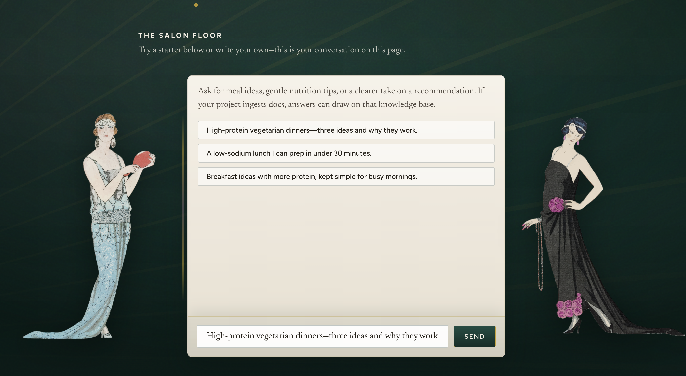
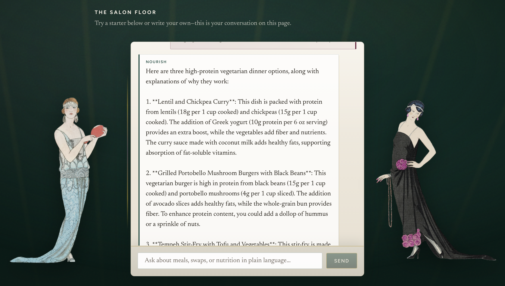

# Nourish — Food Planner (RAG chatbot)

**Idea behind it:** I’m vegetarian (no meat, fish, poultry, or eggs). I've gotten into cooking and I wanted **meal + recipe ideas that I can trust.** I decided that I could have it **run** locally on **Ollama** with **Chroma** RAG so that it's mine first, but still fine to **demo or share** with a link.

I have an interest in fashion and the art-deco style, so I aimed to have **1920s / salon energy**—jewel greens, brass, paper panels—because that’s what I like to look at. Details: [docs/STYLE_GUIDE.md](docs/STYLE_GUIDE.md).

**Live demo (swap in yours):** frontend `https://…` · API `https://…` — set `VITE_API_BASE_URL` and `CORS_ORIGINS` to match.

## Screenshots

**Landing**


**Chat (empty state)**



**Chat (conversation)**




**Disclaimer:** Nourish only gives **general meal-planning information**. It is **not** medical advice. Allergies, conditions, meds—talk to a clinician or dietitian.

---

### What you’re looking at

- **Backend:** Flask, RAG ([`backend/rag_service.py`](backend/rag_service.py)), Chroma, Ollama, SQLite chat history ([`backend/database.py`](backend/database.py)). Routes: `/api/chat`, `/api/ingest`, `/api/history/...`, `/health` — see [docs/API.md](docs/API.md).
- **Frontend:** React (Vite), chat dock inside the deco shell, history hydration when a `conversation_id` is stored (refresh-friendly).
- **Safety:** Pattern-based refusals for sensitive prompts ([`backend/safety.py`](backend/safety.py)); visible notice in the UI.
- **Scope:** Phase A vs later “life planner” ideas — [docs/MVP_SCOPE.md](docs/MVP_SCOPE.md).

### Why not “just use ChatGPT in the browser”?

The model answers **after retrieval from your ingested docs**, not from vibes alone. You control **ingest**, **prompts**, **where it runs**, and this **UI**—it’s a small product, not a single chat tab. (If you never ingest real notes, it’ll feel closer to generic chat—so feed it corpus you care about.)

---

## Prerequisites

- Python **3.10+**
- Node **18+** and npm
- [Ollama](https://ollama.com) running locally (or pointed at with `OLLAMA_HOST`)

```bash
ollama pull nomic-embed-text
ollama pull llama3.2
```

Overrides: `OLLAMA_EMBED_MODEL`, `OLLAMA_CHAT_MODEL`, `OLLAMA_HOST`.

## Backend

```bash
cd backend
python3 -m venv .venv
source .venv/bin/activate   # Windows: .venv\Scripts\activate
pip install -r requirements.txt
python app.py
```

Default API: **http://localhost:5000** (`FLASK_HOST`, `FLASK_PORT`).

### Ingest (do this once per fresh clone / after wiping Chroma)

```bash
curl -X POST http://localhost:5000/api/ingest
```

Reloads vectors from `backend/sample_docs/*.txt`. If `INGEST_SECRET` is set, add `-H "X-Ingest-Secret: YOUR_SECRET"`.

### Health

```bash
curl http://localhost:5000/health
```

## Frontend

```bash
cd frontend
npm install
npm run dev
```

**http://localhost:5173** — copy [frontend/.env.example](frontend/.env.example) to `frontend/.env.local`:

```bash
VITE_API_BASE_URL=http://localhost:5000
```

## Environment variables

| Variable | Where | Purpose |
|----------|--------|---------|
| `OLLAMA_HOST` | backend | Default `http://localhost:11434` |
| `OLLAMA_EMBED_MODEL` | backend | Default `nomic-embed-text` |
| `OLLAMA_CHAT_MODEL` | backend | Default `llama3.2` |
| `CHROMA_PATH` | backend | Vector store dir (default `chroma_db` under `backend/`) |
| `DB_PATH` | backend | SQLite file (default `chat_history.db` under `backend/`) |
| `CORS_ORIGINS` | backend | Comma-separated origins |
| `RATE_LIMIT_ENABLED` | backend | `true` to rate-limit `POST /api/chat` in production |
| `CHAT_RATE_LIMIT` | backend | e.g. `60 per minute` |
| `DISABLE_INGEST` | backend | `true` → ingest returns 403 |
| `INGEST_SECRET` | backend | If set, require `X-Ingest-Secret` on ingest |
| `HIDE_INTERNAL_ERRORS` | backend | Generic 500 message for users |
| `VITE_API_BASE_URL` | frontend | API base URL at build time |

## Tests

```bash
cd backend && pytest tests/ -q
cd frontend && npm test
```

(or your repo’s `scripts/ci.sh` if present)

## VS Code

Open repo root → Python interpreter `backend/.venv` → terminals: Ollama, `python app.py`, `npm run dev`. Debug: “Python: Flask app.py” in [.vscode/launch.json](.vscode/launch.json).

## Deploy (short version)

Static frontend (Vercel/Netlify/etc.) + Flask on a small PaaS; set `CORS_ORIGINS` and `VITE_API_BASE_URL`. Don’t expose ingest without a secret. Turn on `RATE_LIMIT_ENABLED` when the API is public.

## Troubleshooting

**npm SSL errors:** `NODE_EXTRA_CA_CERTS` or `npm config set cafile` to your corporate root—avoid permanent `strict-ssl false`.

**Ollama errors:** service up? models pulled? Response JSON `code` e.g. `ollama_unavailable`.

**Weak answers:** run `/api/ingest`; add richer `.txt` files under `backend/sample_docs/`.

## Architecture & resume packaging

- [docs/ARCHITECTURE.md](docs/ARCHITECTURE.md)  
- RAG spot-checks: [docs/rag_golden.md](docs/rag_golden.md) (if present)

## License

[MIT](LICENSE). Third-party assets (e.g. Freepik illustrations) stay under their own licenses—see [frontend/public/illustrations/ATTRIBUTION.txt](frontend/public/illustrations/ATTRIBUTION.txt).
