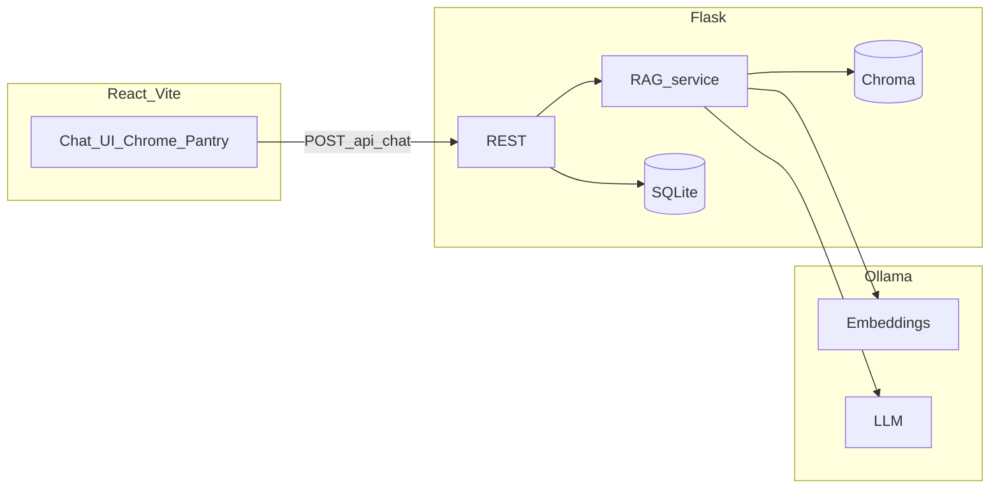

# Architecture

| Layer | Responsibility |
|-------|----------------|
| `frontend/` | Vite + React; `VITE_API_BASE_URL` points at Flask. |
| `backend/app.py` | HTTP routes, CORS, JSON errors with optional `code`. |
| `backend/rag_service.py` | Chunking, Ollama embed/generate, Chroma query. |
| `backend/database.py` | SQLite schema for conversations and messages. |
| `backend/sample_docs/` | Versioned text corpus for RAG. |

See [API.md](API.md) for the REST contract and [STYLE_GUIDE.md](STYLE_GUIDE.md) for the UI system.
