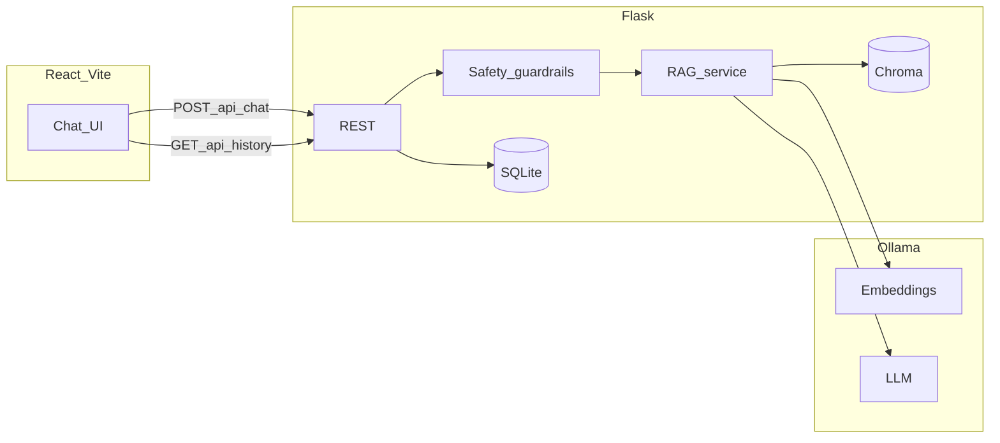

# Architecture

## Request flow (deployed)

1. **Browser** loads the static Vite build (e.g. Vercel/Netlify). `VITE_API_BASE_URL` points at the Flask host (e.g. Render/Railway/Fly).
2. **Chat:** `POST /api/chat` with optional `conversation_id` → RAG (`rag_service`) → Ollama + Chroma → response; messages persisted in SQLite when DB writes succeed.
3. **Refresh:** The UI stores `conversation_id` in `localStorage` and hydrates via `GET /api/history/<conversation_id>` before new sends.
4. **Ingest:** `POST /api/ingest` rebuilds the vector index from `backend/sample_docs/*.txt` (protect or disable in production via env).

| Layer | Responsibility |
|-------|----------------|
| `frontend/` | Vite + React; `VITE_API_BASE_URL` points at Flask; history hydration + `localStorage` continuity. |
| `backend/app.py` | HTTP routes, CORS, rate limiting (optional), ingest protection, JSON errors with optional `code`. |
| `backend/safety.py` | Pattern-based refusal for sensitive medical-style prompts (no LLM call). |
| `backend/rag_service.py` | Chunking, Ollama embed/generate, Chroma query. |
| `backend/database.py` | SQLite schema for conversations and messages. |
| `backend/sample_docs/` | Versioned text corpus for RAG. |

See [API.md](API.md) for the REST contract and [STYLE_GUIDE.md](STYLE_GUIDE.md) for the UI system.

## Deployment reference

- **Frontend:** Build with `npm run build`; host `frontend/dist` on any static host. Use [frontend/vercel.json](../frontend/vercel.json) (or equivalent SPA fallback). Set `VITE_API_BASE_URL` at build time to your API origin.
- **Backend:** Run with Gunicorn, e.g. `gunicorn --bind 0.0.0.0:$PORT wsgi:application` from `backend/` (see [render.yaml](../render.yaml)). Set `CORS_ORIGINS` to your frontend origin(s). Ollama must be reachable from the API process (`OLLAMA_HOST`).
